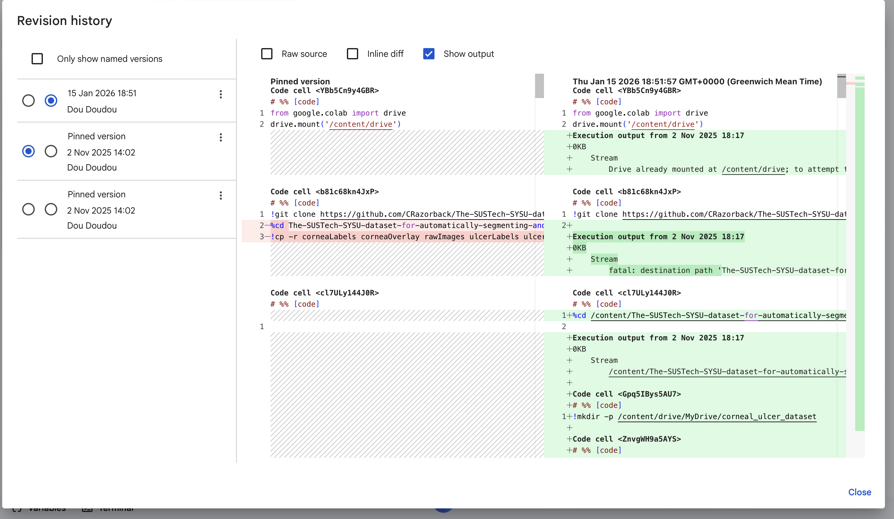
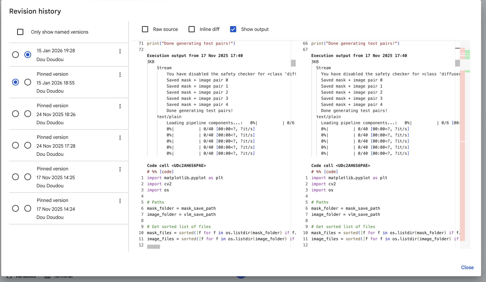
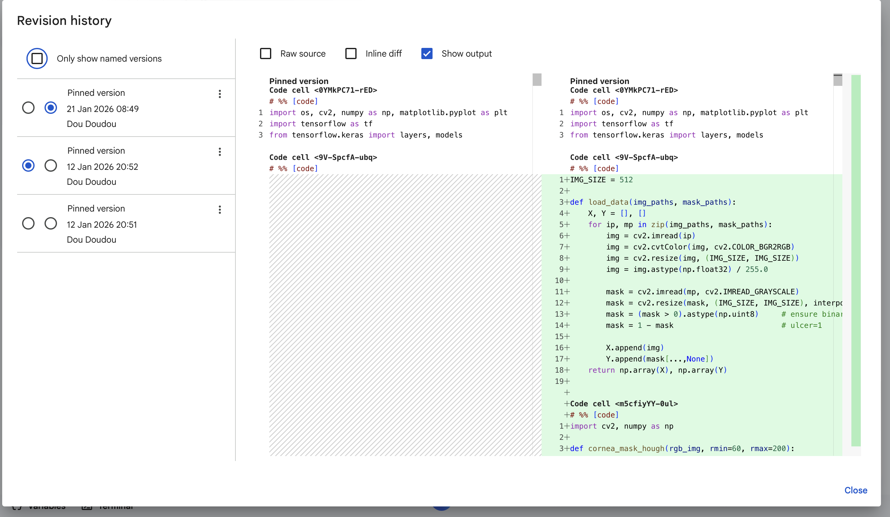
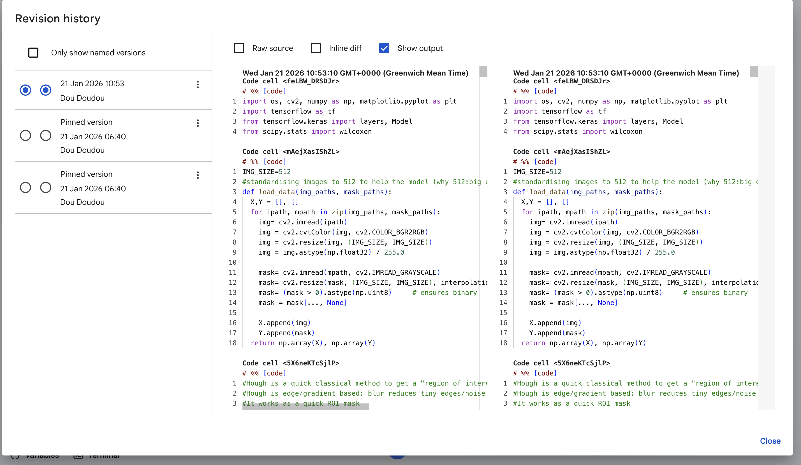
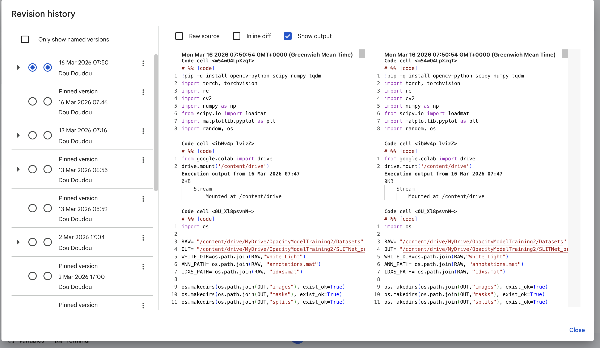
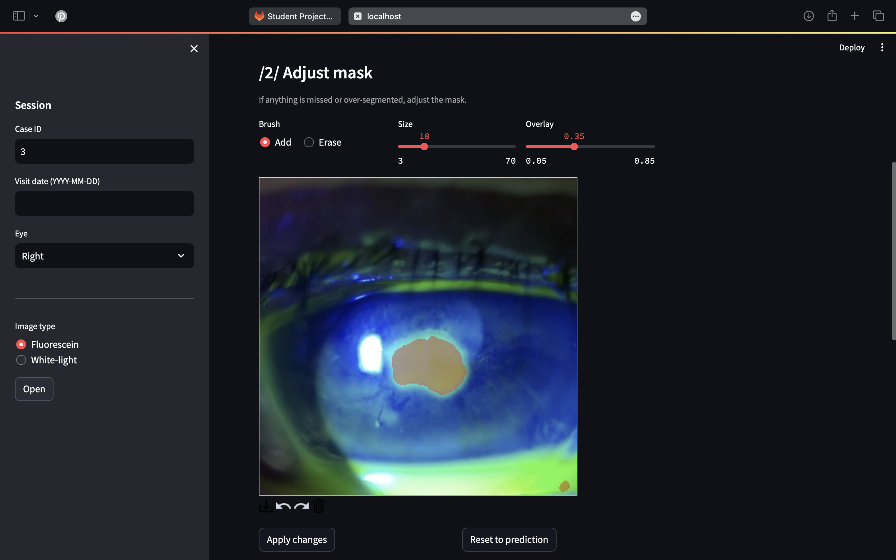
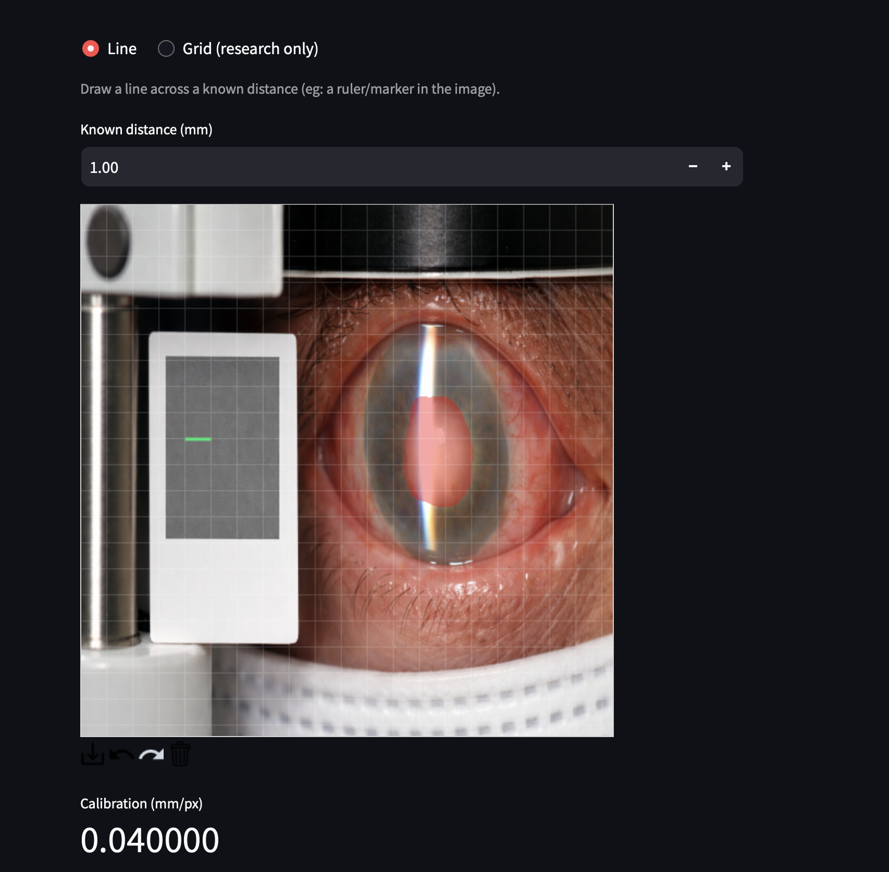
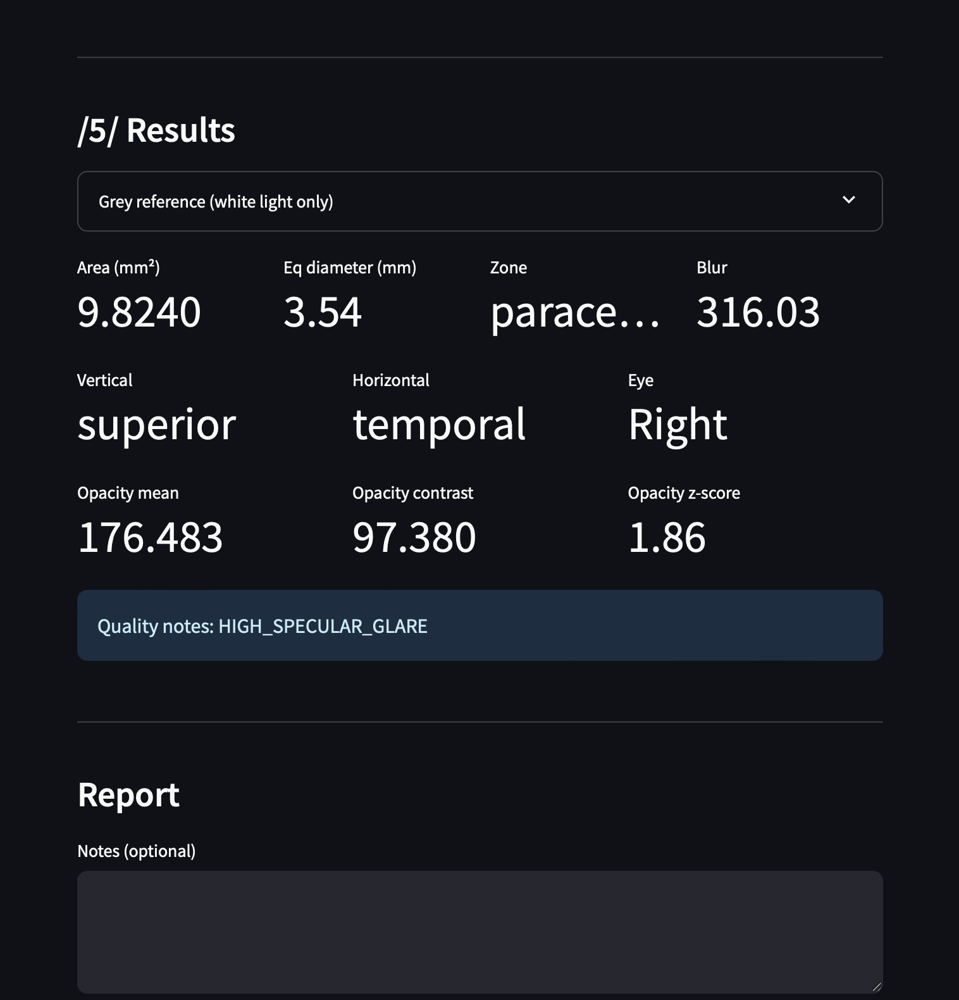
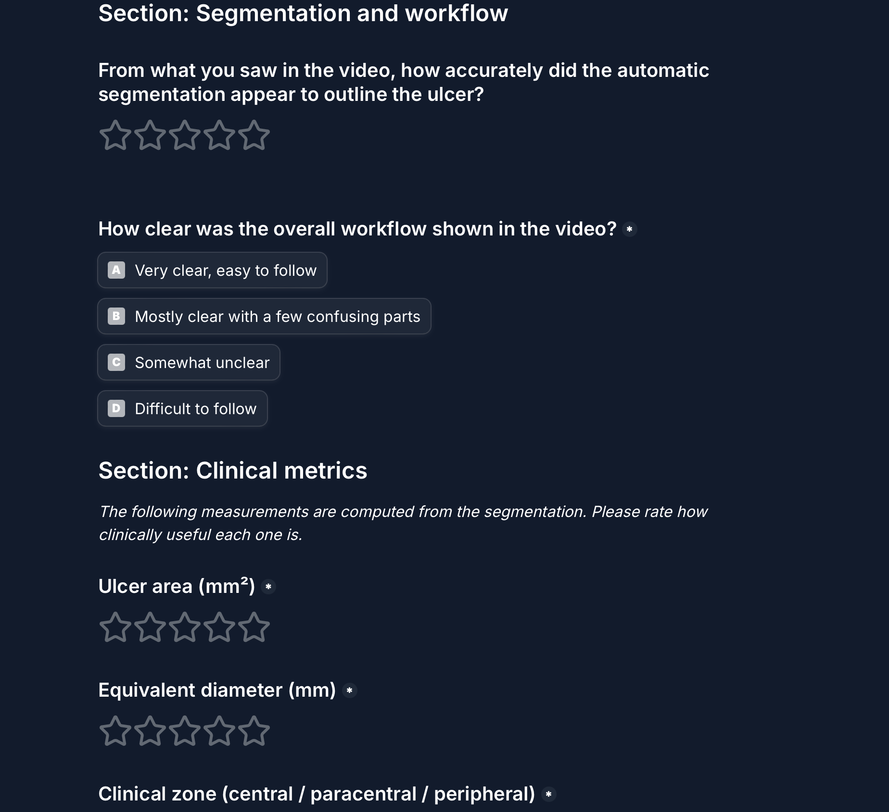

# Automated Corneal Ulcer Measurement and Monitoring System

**Final Year Project - Computer Science, University of Birmingham (2025–2026)**  
**Clinical Advisor:** Mr Gibran Butt, Consultant Ophthalmologist  
**Submitted report (10-page):** `FYP_Report.pdf`  
**Full extended report:** `FYP_Full_Report.pdf`
<br>
**Video Demonstration:** (Watch here) https://youtu.be/xKd9gxOVXlw

> *"This type of tool does not currently exist. If validated prospectively, it would be a meaningful contribution to anterior segment imaging and there is a paper in this."*  
> - Mr Gibran Butt, Consultant Ophthalmologist.

---

## What This Project Does

A complete, deployable AI-assisted clinical tool that:
- Automatically **segments corneal ulcers** from slit-lamp photographs: two separate models for fluorescein and white-light imaging modalities
- Computes **calibrated clinical measurements**: area (mm²), equivalent diameter (mm), corneal zone (central / paracentral / peripheral), anatomical quadrant (superior/inferior, nasal/temporal with correct left/right eye handling)
- Computes a **white-light opacity proxy** (CLAHE intensity z-score): white-light only, per clinical advice from Mr Butt
- Generates **LLM-assisted clinical documentation notes** (Groq API, llama-3.3-70b-versatile), strictly constrained to be non-diagnostic
- Tracks visits **longitudinally** in a local SQLite database with trend charts for area, diameter and opacity over time
- Built with **privacy-by-design**: no patient images stored, pseudonymous case IDs only, GDPR-compliant, full audit logging

No comparable commercial or academic system exists that combines segmentation, calibrated measurement, longitudinal tracking and clinical reporting for corneal ulcers from slit-lamp images.

---

## Repository Structure

```
├── app.py                        # Main Streamlit application (5-step workflow, dual modality)
├── analysis.py                   # Clinical measurement pipeline (pure NumPy/OpenCV, no ML deps)
├── ulcer_unet_infer.py           # White-light PyTorch UNetResNet34 architecture + inference
├── db.py                         # SQLAlchemy/SQLite database schema + audit logging
├── llm_report.py                 # Groq LLM report generation + deterministic fallback template
├── test_analysis.py              # 20 unit tests for the analysis module (pytest)
├── PRIVACY.md                    # Full GDPR/privacy notice displayed within the application
├──RealDataModelv2.keras  # Trained fluorescein U-Net checkpoint (deployed model)
├──best.pt                   # Trained white-light ResNet34 U-Net checkpoint
│     
│   
│
├──ColabNotebooks/                    # All 11 Colab experimental notebooks
│   ├── STEP1_FYPRealDataPreProcessing.ipynb
│   ├── STEP2_DiffusionModelSyntehticUlcerData.ipynb
│   ├── Small_GAN_trained_on_masks.ipynb
│   ├── Syntehtic_data_generation_v1_.ipynb
│   ├── notceilignscore_model.ipynb
│   ├── SyntheticDatav2.ipynb
│   ├── beforeFinalSyntehticDataFYP.ipynb
│   ├── FinalNoRoiModel.ipynb
│   ├── real_synthetic_final_models.ipynb
│   ├── OpacityModel.ipynb
│   └── FINALAPPRUN.ipynb
│
├── synthetic_samples/            # 5 representative v4 synthetic image/mask pairs
├── FYP_Report.pdf
├── FYP_Full_Report.pdf
└── README.md
```

---

## Note on Commit History

This repository has few commits because **all experimental work was developed iteratively in Google Colab**, which has no native Git integration. The notebooks and their embedded outputs are the primary evidence of iterative development, each one builds on the conclusions of the previous one.

### Colab Revision History Screenshots

| Notebook | Screenshot |
|---|---|
| STEP1 - Real data preprocessing |  |
| STEP2 - Stable Diffusion attempt |  |
| FinalNoRoiModel - Fluorescein training |  |
| real_synthetic_final_models - Full evaluation |  |
| OpacityModel - White-light training |  |

---

## Full Notebook Pipeline - Order and Contents

The 11 notebooks follow a clear five-phase pipeline. Read them in order to follow the experimental arc from raw data to deployed model.

---
| # | Notebook | What it does | Key output |
|---|---|---|---|
| 1 | STEP1_FYPRealDataPreProcessing | Clones SUSTech-SYSU dataset, verifies file triples, crops to cornea, splits 247/35/72 | train/val/test .npy arrays |
| 2 | STEP2_DiffusionModelSyntehticUlcerData | Stable Diffusion ControlNet attempt - **rejected**, domain mismatch | None |
| 3 | Small_GAN_trained_on_masks | DCGAN to generate mask shapes | generated_ulcer_masks/ |
| 4 | Syntehtic_data_generation_v1_ | pix2pix mask→image - **rejected**, under-conditioned, GAN artefacts | perturbed_masks.npy |
| 5 | notceilignscore_model | pix2pix v2/v3 with 3-channel conditioning; label inversion fix; Wilcoxon test (p=0.71) | perturbed_masks_v2.npy, p-values |
| 6 | SyntheticDatav2 | Elastic deformation analysis, real-vs-synthetic comparison grid | synthetic_v3 pairs |
| 7 | beforeFinalSyntehticDataFYP | v4 noise-hybrid approach, quality filter (100% retention), 3705 pairs | synthetic_v4_noise_arrays.npz |
| 8 | FinalNoRoiModel | Fluorescein U-Net training, Focal Tversky loss, ROI vs no-ROI evaluation | RealDataModelv2.keras |
| 9 | real_synthetic_final_models | Full evaluation of all 4 configs, Wilcoxon test, zero overlap check, qualitative grids | Table 1 results |
| 10 | OpacityModel | White-light ResNet34 U-Net on SLITNet, 26 missing entries handled, test Dice 0.370/0.047 | best.pt |
| 11 | FINALAPPRUN | End-to-end pipeline test before Streamlit was built | Confirms analysis module output |
---

## Quick Reference - Where to Find Everything

| What you want to verify | Notebook / File |
|---|---|
| Dataset structure: why 354 not 712 images | `STEP1_FYPRealDataPreProcessing.ipynb` |
| Crop-to-cornea preprocessing logic | `STEP1_FYPRealDataPreProcessing.ipynb` |
| Train/val/test split sizes (247/35/72) | `STEP1_FYPRealDataPreProcessing.ipynb` |
| Why Stable Diffusion was rejected | `STEP2_DiffusionModelSyntehticUlcerData.ipynb` |
| DCGAN mask generator architecture | `Small_GAN_trained_on_masks.ipynb` |
| pix2pix under-conditioning diagnosis | `Syntehtic_data_generation_v1_.ipynb` (conclusion cell) |
| Label inversion bug - first encounter | `Syntehtic_data_generation_v1_.ipynb` |
| Label inversion bug - formal correction | `notceilignscore_model.ipynb` + `real_synthetic_final_models.ipynb` |
| Wilcoxon test code and p-values (p=0.71, p=0.65) | `notceilignscore_model.ipynb` (corrected) |
| 3-channel conditioning design (cornea + ulcer + Canny) | `notceilignscore_model.ipynb` + `SyntheticDatav2.ipynb` |
| Real vs synthetic comparison grid | `SyntheticDatav2.ipynb` |
| Elastic deformation triplet visualisation | `SyntheticDatav2.ipynb` |
| v4 noise-hybrid approach + quality filter (100% retention) | `beforeFinalSyntehticDataFYP.ipynb` |
| U-Net architecture definition | `FinalNoRoiModel.ipynb` |
| Focal Tversky loss with clinical justification | `FinalNoRoiModel.ipynb` |
| Hough ROI implementation | `FinalNoRoiModel.ipynb` |
| All four model evaluation numbers (Table 1) | `real_synthetic_final_models.ipynb` |
| Zero train-test overlap verification | `real_synthetic_final_models.ipynb` |
| Worst-case analysis (77 pixels, predicted 0) | `real_synthetic_final_models.ipynb` |
| Qualitative best/median/failure segmentation grid | `real_synthetic_final_models.ipynb` |
| SLITNet HDF5 parsing + 26 missing entries | `OpacityModel.ipynb` |
| White-light ResNet34 U-Net PyTorch definition | `OpacityModel.ipynb` + `ulcer_unet_infer.py` |
| White-light test results (0.370 / 0.047) | `OpacityModel.ipynb` (final evaluation cell) |
| Validation instability evidence (±0.3 between epochs) | `OpacityModel.ipynb` (epoch logs) |
| Deployed model filename (`final_real_noROI.keras`) | `FINALAPPRUN.ipynb` |
| Full pipeline end-to-end test | `FINALAPPRUN.ipynb` |
| Measurement functions (area, zone, quadrant, opacity) | `analysis.py` |
| Unit tests for all measurement functions | `test_analysis.py` |
| Database schema, audit logging | `db.py` |
| LLM prompt design + fallback template | `llm_report.py` |
| GDPR / privacy policy | `PRIVACY.md` |

---
> Note: The prototype notebook (`FINALAPPRUN.ipynb`) used `final_real_noROI.keras`. 
> The model was renamed to `RealDataModelv2.keras` before final deployment in `app.py`.

## Running the Application

```bash
pip install streamlit tensorflow torch torchvision opencv-python sqlalchemy \
            pillow numpy pandas reportlab openai streamlit-drawable-canvas
streamlit run app.py
```

Requires `RealDataModelv2.keras` and `best.pt`. Optional Groq API key in `.streamlit/secrets.toml` as `GROQ_API_KEY = "..."` - the deterministic fallback template works without it.

**Unit tests:**
```bash
pytest test_analysis.py -v
```
All 20 tests use synthetic numpy arrays - no model weights or patient data needed.

---

## Evaluation Results

### Fluorescein Model (n=72 held-out, corrected label encoding)

| Model / Setting | Dice Mean | Dice Median | IoU Mean | N |
|---|---|---|---|---|
| **Real-only, No ROI ★ (deployed)** | **0.706** | **0.809** | **0.602** | **72** |
| Real-only, With ROI | 0.752 | 0.824 | 0.664 | 72 |
| Mixed Real+Synthetic, No ROI | 0.659 | 0.716 | 0.530 | 72 |
| Pretrain Synthetic → Fine-tune Real | 0.712 | 0.776 | 0.608 | 72 |

Wilcoxon signed-rank test: **p=0.71 (Dice), p=0.65 (IoU)** - synthetic augmentation neutral at this data scale.

### White-Light Model (n=14 held-out, fold k1)

Dice mean=0.370, median=0.047, std=0.421, min=0.000, max=0.931. Low performance is a data scarcity problem (66 training images), not an architecture problem.

---

## Application Screenshots



**Generated report example:** [View here](Screenshots/app4.pdf)

---

## Synthetic Data Samples

Five representative v4 noise-augmented pairs in `synthetic_samples/` (image + mask per sample). The evaluation showed adding synthetic data did **not** improve performance (p=0.71) - an honest null result.

---

## Clinical Feedback

Mr Gibran Butt: *"This is excellent. Really well done. As it stands it's a really well put together proof of concept... I think this is very much worth publishing in a peer reviewed journal."*

**Feedback survey:** [tally.so/r/BzZav5](https://tally.so/r/BzZav5)



**Video demonstration:** (Watch here) https://youtu.be/xKd9gxOVXlw
Demonstrates the full five-step workflow: image upload → automatic segmentation → mask editing → calibration → results and report generation.


---

## Privacy and GDPR

- **No patient images stored** - SHA-256 hash fingerprint only
- **No patient-identifiable information** - pseudonymous case IDs only
- **Local only** - `data_store/app.db` on the device running the application
- **Third-party:** Groq API receives computed measurements only (no images, no identifiers)
- **Audit logging:** every save/delete to `data_store/audit.log` with timestamps
- **DPIA required** before any real clinical deployment - see `PRIVACY.md`

---

## Datasets
- **SUSTech-SYSU** (fluorescein): https://doi.org/10.1038/s41597-020-0360-7
- **SLITNet** (white-light): https://github.com/jessicaloohw/SLIT-Net/

---

## GenAI Usage

ChatGPT assisted with report drafting. Specific AI-assisted sections are attributed in inline comments in the code. All results, metrics, architectures and design decisions were drawn from the author's own notebooks and verified before inclusion.

---

*Developed by Douaa Ghezali · University of Birmingham · 2025–2026*